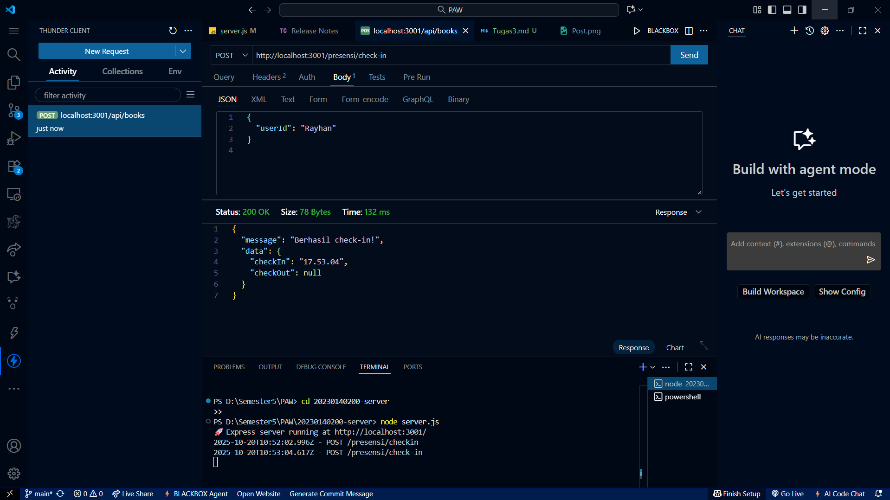
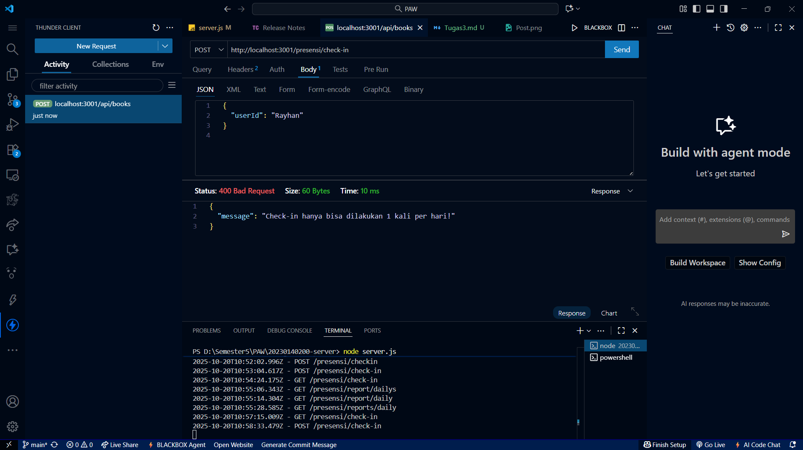
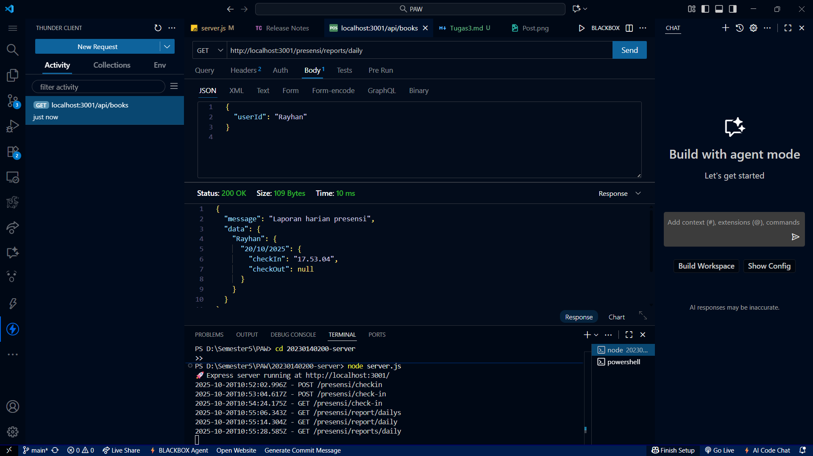

# 🧾 Tugas 3 - Dokumentasi API Presensi

## 1️⃣ Endpoint: POST /presensi/check-in
### ✅ Berhasil Check-in

### ⚠️ Jika Sudah Pernah Check-in

---

## 2️⃣ Endpoint: POST /presensi/check-out
### ✅ Berhasil Check-out

### ⚠️ Double Check-out

### ⚠️ Belum Pernah Check-in (Gagal Check-out)

---

## 3️⃣ Endpoint: GET /presensi
### 📋 Data Presensi
